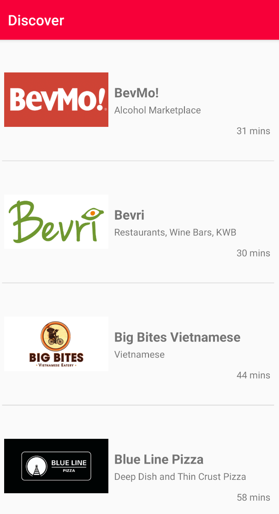
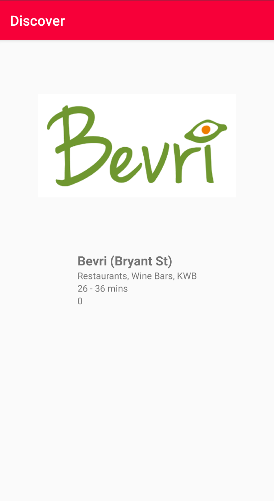

# DoorDash Android App

DoorDash Application to represent list of restaurants and detailed restaurant information on list click.

## What is implemented
1. Main restaurants screen
2. Scrolling animation for smooth scrolling
3. Detailed restaurant screen 

## What is tested
1. Unit test covers layer which queries list of restaurant from the server
2. Unit test covers layer which queries specific restaurant from the server

## Further Improvements
1. To display list of data switch to RecyclerView with with custom recycler adapter, to boost up performance.
2. Implements MVVM pattern using LiveData(represented by model) and and viewmodel Data Bindings to the view(represented by activities, fragments)
3. Enhance logging throughout the entire application
4. Unit Test all main classes and core functionality corresponding to the improved architecture
5. Develop data emulator, which will provide offline data for testing purposes
